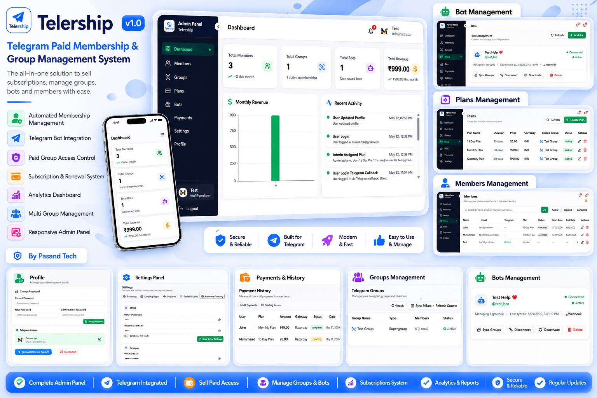
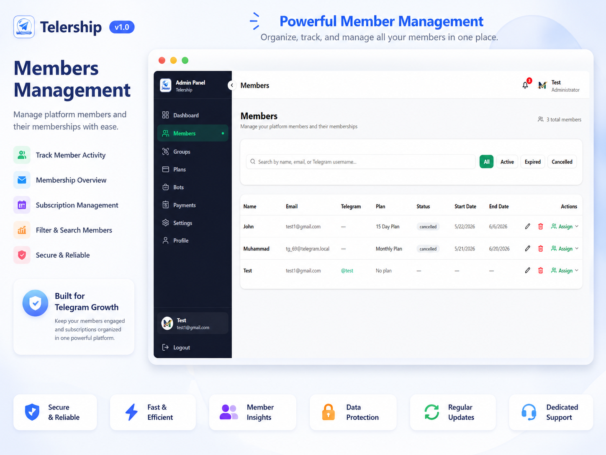
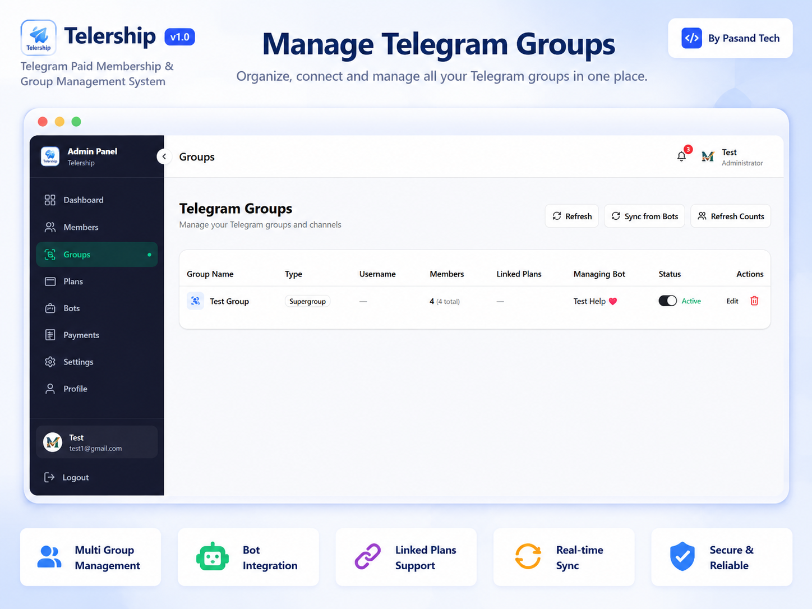
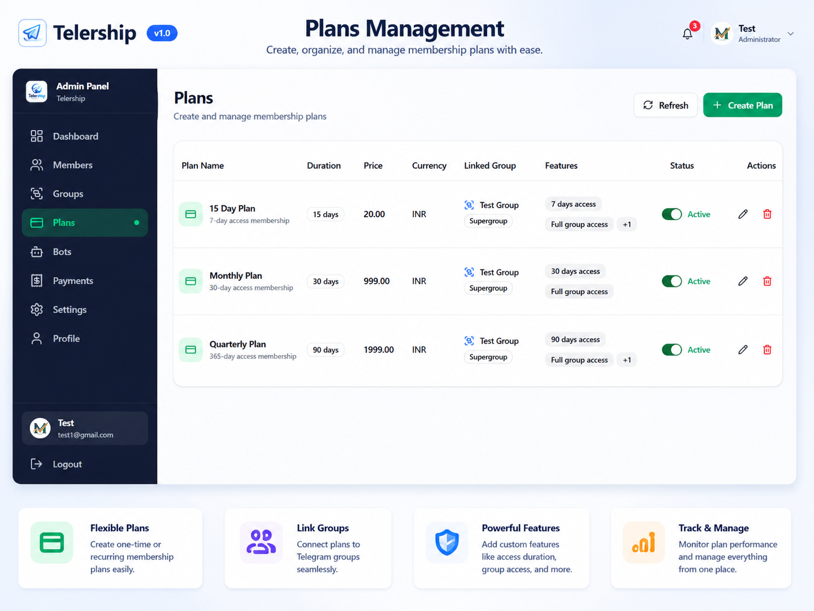
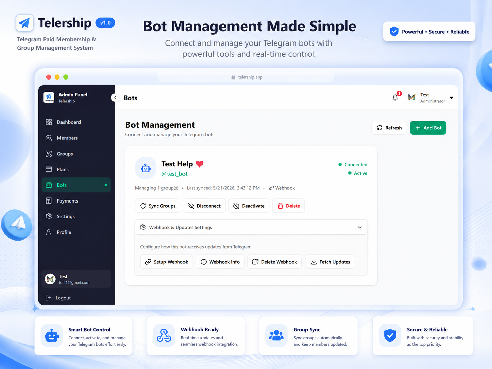
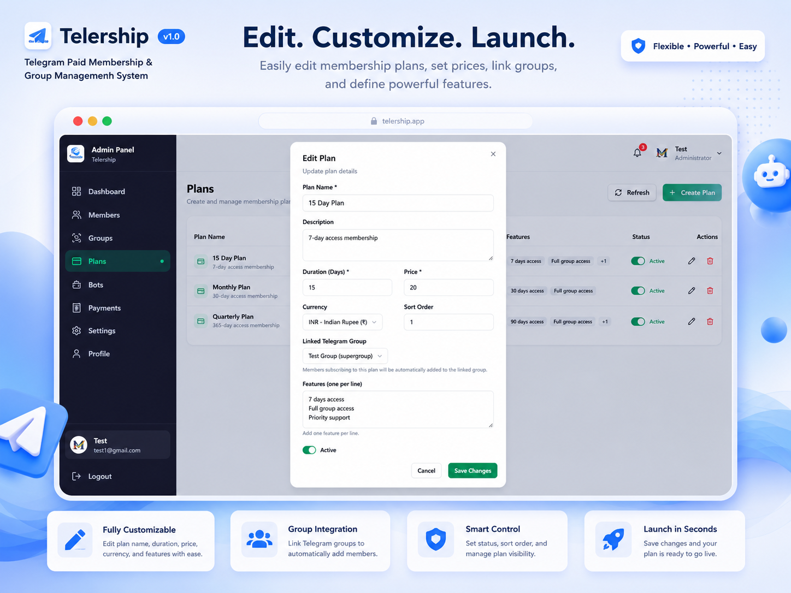
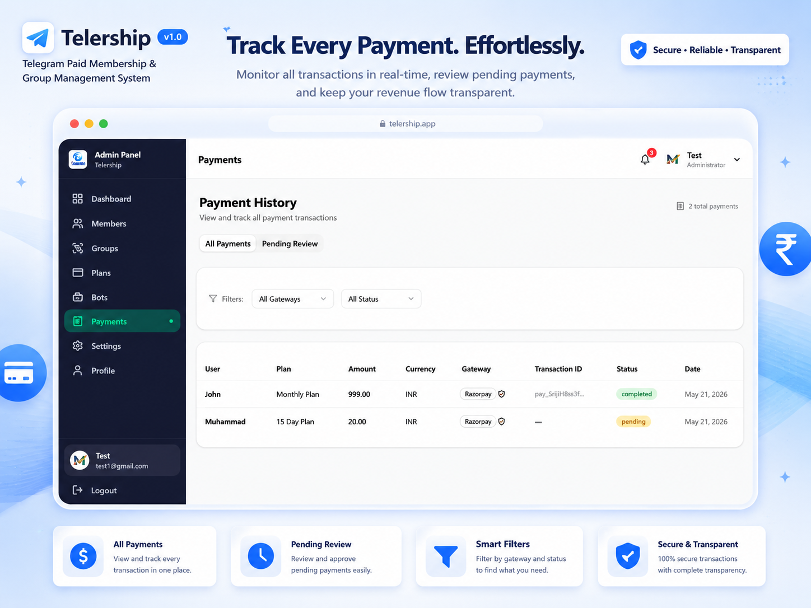
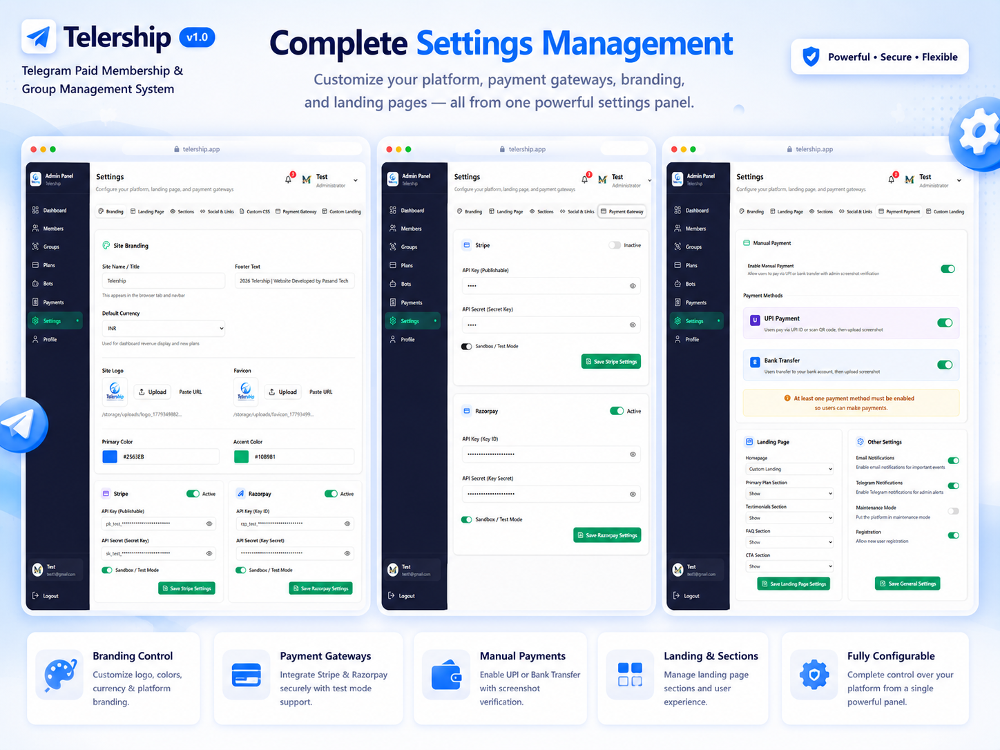
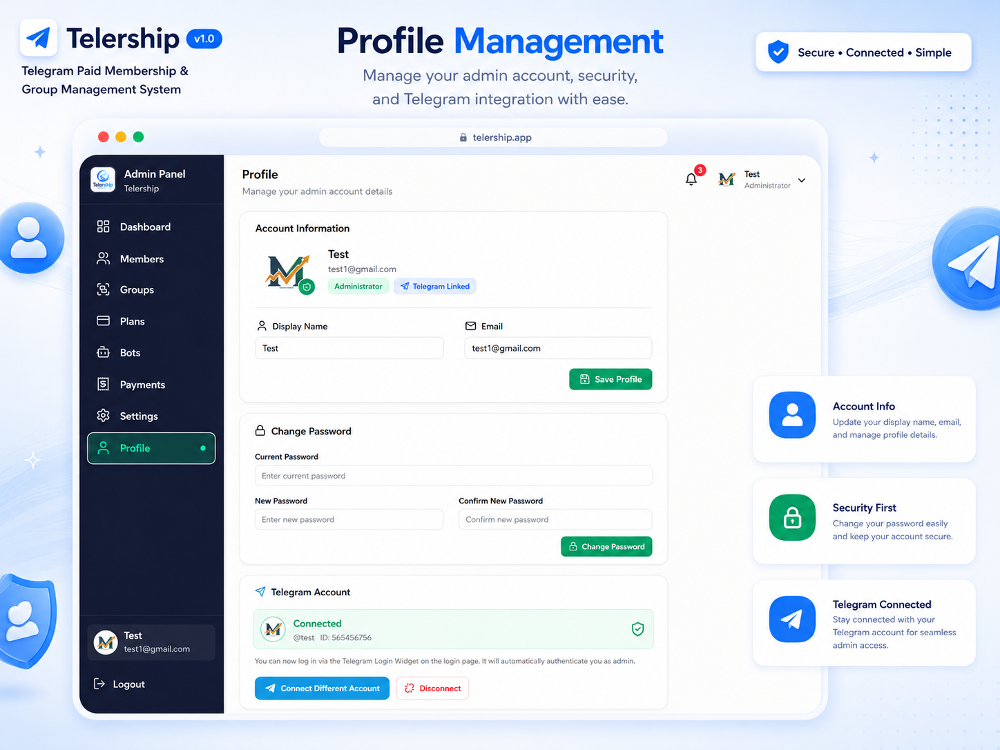

# ⚡ Telership — Telegram Group Management Bot & Membership Panel

**The most powerful self-hosted Telegram subscription bot to manage paid channels, accept payments, and auto-kick expired members.**

[🛒 Get Full Source Code — $39 (Launch Sale)](https://pasandtech.com/telegram-group-management-bot/) · [💬 Buy via WhatsApp](https://api.whatsapp.com/send?phone=917990929117&text=Hello%2C%20i%20want%20to%20buy%20this%0D%0A%0D%0A%2ATelership%20-%20Telegram%20Group%20Management%20Bot%20%26%20Membership%20Panel%20v2.0%2A%0D%0A%2APrice%3A%2A%20~%2479.00~%20%2439.00%0D%0A%0D%0AThank%20you%21&app_absent=0)

---

## 🔥 The Ultimate Telegram Channel Management Bot

Running a paid Telegram channel shouldn't mean spending hours manually adding members, chasing expired subscriptions, and losing revenue. **Telership** is the all-in-one **Telegram group management bot** designed to automate your subscription business.

Whether you run a trading signals group, premium content channel, or paid community, Telership gives you the tools to **manage your Telegram channel** effortlessly from a single web dashboard. Unlike cloud-based platforms that charge monthly fees and take a cut of your revenue, Telership is self-hosted — you pay once, own the source code forever, and keep 100% of your profits.

### Why Choose Telership?

- ❌ **Stop:** Manually adding members after every payment
- ❌ **Stop:** Losing revenue from forgotten expired members
- ❌ **Stop:** Paying 5-10% commissions to SaaS platforms like InviteMember
- ✅ **Start:** Using a powerful **Telegram subscription bot** to automate access
- ✅ **Start:** Letting your **Telegram bot accept payments** via Stripe, Razorpay, and UPI
- ✅ **Start:** Using **auto kick members on Telegram** when their subscription expires

---

## ✨ Core Features of this Paid Telegram Bot

Telership is packed with features to turn any Telegram group into a fully automated membership business:

| Feature | Description |
|---------|-------------|
| ⚡ **Automated Member Management** | Instantly add members via invite link on payment. **Auto-kick expired members** from Telegram when their plan ends. |
| 💳 **Multi-Gateway Payments** | A **Telegram bot that accepts payments** via **Stripe** (International), **Razorpay** (India), and **UPI**. |
| 📋 **Subscription Plan Builder** | Create unlimited plans (weekly, monthly, yearly) with custom pricing and group assignments. |
| 📊 **Admin Dashboard & Analytics** | Track total members, active subscriptions, revenue, and payment history in real-time. |
| 🔐 **Telegram Login Integration** | Members log in using the official Telegram Login Widget — no passwords needed. |
| 🔔 **Smart Notifications & Alerts** | Automatic payment confirmations and 3-day expiry reminders sent directly via your bot. |
| 🛡️ **Manual Payment Verification** | Allow members to upload UPI payment screenshots for admin approval. |
| 🎨 **Custom Branding** | White-label the member portal to match your brand identity. |

---

## 📸 Telership Admin Panel & Bot Screenshots

Take a look inside the most powerful **Telegram membership bot** and admin dashboard:

| Screenshot 1 | Screenshot 2 |
|:---:|:---:|
|  |  |
| **Subscription Plans** | **Member Management** |

| Screenshot 3 | Screenshot 4 |
|:---:|:---:|
|  |  |
| **Payment History** | **Payment Gateways** |

| Screenshot 5 | Screenshot 6 |
|:---:|:---:|
|  |  |
| **Revenue Analytics** | **Bot Settings** |

| Screenshot 7 | Screenshot 8 |
|:---:|:---:|
|  |  |
| **Member View** | **Telegram Notifications** |

---

## 🥊 The Best InviteMember Alternative

If you are looking for an **InviteMember alternative** that doesn't eat into your profits, Telership is the ultimate choice. Feature-by-feature, we beat the competition:

| Feature | Telership | InviteMember | MyMembers | Free Bots |
|---------|-----------|--------------|-----------|-----------|
| **Self-hosted (your server)** | ✅ YES | ❌ NO | ❌ NO | N/A |
| **No commission on payments** | ✅ 0% | ❌ 5–10% | ❌ 5% | N/A |
| **No monthly SaaS fee** | ✅ YES | ❌ Monthly | ❌ Monthly | ✅ YES |
| **Telegram Bot Stripe Payments** | ✅ YES | ✅ YES | ✅ YES | ❌ NO |
| **Telegram Bot UPI Payment** | ✅ YES | ❌ NO | ❌ NO | ❌ NO |
| **Razorpay Integration** | ✅ YES | ❌ NO | ❌ NO | ❌ NO |
| **Manual Payment Verification** | ✅ YES | ❌ NO | ❌ NO | ❌ NO |
| **Auto-kick expired members** | ✅ YES | ✅ YES | ✅ YES | Limited |
| **Full Source Code Access** | ✅ YES | ❌ NO | ❌ NO | Varies |

---

## 🚀 How to Set Up Paid Access for Your Telegram Channel

Getting your **paid Telegram bot** up and running takes just 3 simple steps:

1. **Connect Your Bot:** Add your Telegram bot token to the Telership dashboard. The panel syncs your groups automatically.
2. **Create Subscription Plans:** Set duration, price, currency, and assign which group each plan grants access to. Enable Stripe, Razorpay, or UPI.
3. **Share & Earn:** Share your membership link. Members pay and are added instantly. Expired members are auto-kicked.

---

## 💰 Pricing: Pay Once, Own Forever

Telership is a premium, self-hosted script. No monthly fees. No commission. You pay once and own it forever.

🔥 **Launch Sale: First 100 buyers get 51% OFF!**

| License | Regular Price | Sale Price |
|---------|---------------|------------|
| **Full License + Source Code** | ~~$79.00~~ | **$39.00** |

👉 **Purchase it here:** [pasandtech.com/telegram-group-management-bot](https://pasandtech.com/telegram-group-management-bot/)
💬 **Or chat with us directly:** [Buy via WhatsApp](https://api.whatsapp.com/send?phone=917990929117&text=Hello%2C%20i%20want%20to%20buy%20this%0D%0A%0D%0A%2ATelership%20-%20Telegram%20Group%20Management%20Bot%20%26%20Membership%20Panel%20v2.0%2A%0D%0A%2APrice%3A%2A%20~%2479.00~%20%2439.00%0D%0A%0D%0AThank%20you%21&app_absent=0)

**What's included:**
- ✅ Complete Source Code (Web Panel + Telegram Bot)
- ✅ Lifetime Access & Free Updates
- ✅ Self-hosted — Zero Commissions on Payments
- ✅ Easy Installation Documentation
- ✅ 30-Day Refund Policy

---

## ❓ Frequently Asked Questions

**What is a Telegram group management bot?**
A Telegram group management bot is an automated tool that helps administrators manage members, collect payments, control access, and moderate conversations from a web dashboard instead of manually through the Telegram app.

**How does a Telegram subscription bot work?**
The bot connects to your Telegram group via the Bot API. When a user pays (through Stripe, Razorpay, or UPI), it automatically generates an invite link and adds them. When the subscription expires, the bot automatically removes them.

**Can I accept UPI payments through a Telegram bot?**
Yes. Telership supports UPI payment integration for Indian users, along with Razorpay and Stripe for international payments. It also supports manual screenshot verification.

**How do I auto-kick expired members from my Telegram group?**
Telership runs automated expiry checks. When a member's subscription expires, the bot uses the Telegram Bot API to automatically remove (ban) them from the group. They receive a reminder 3 days before expiry.

**Is Telership self-hosted or a cloud service?**
Telership is fully self-hosted on your own server. You get the complete source code, no monthly fees, zero commission on payments, and full control over your data.

---

## 📜 License & Usage

This repository is for **showcase and documentation purposes only**.

The source code for Telership is proprietary software. Purchasing a license grants you the right to use and modify the code for your own use case, but redistribution or reselling of the source code is strictly prohibited.

To purchase a license, visit: [https://pasandtech.com/telegram-group-management-bot/](https://pasandtech.com/telegram-group-management-bot/)

---

### Ready to monetize your Telegram channel with the best Telegram membership bot?

**[🛒 Get Telership Now for $39](https://pasandtech.com/telegram-group-management-bot/)**

 

Copyright © 2025 [PasandTech](https://pasandtech.com). All rights reserved.

